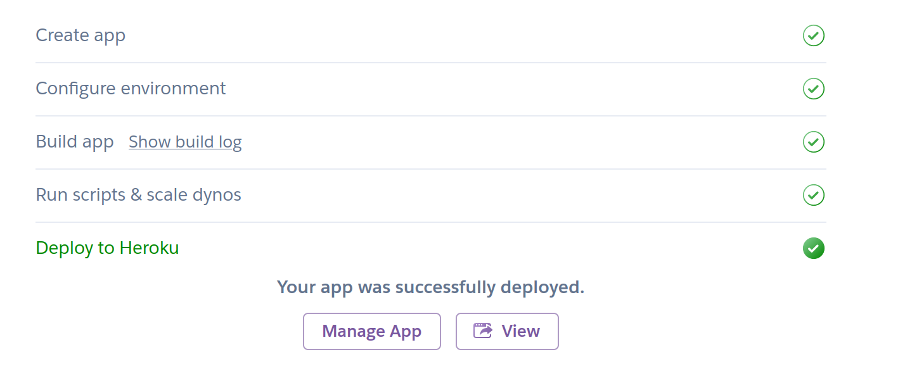

# Deployment
Currently, three ways of deploying are supported out of the box. Docker, Render and Heroku.

1. [Deploy with Docker](#deploy-with-docker)
2. [Deploy with Render](#deploy-with-render)
3. [Deploy with Heroku](#deploy-with-heroku)

Once you have set one of them up, you will need to follow the [next steps](#next-steps) to set up storage, email, text messagea and more!

## Deploy with Docker
You can easily deploy ChiefOnboarding with Docker (Docker-compose). Make sure that both Docker and Docker-compose are installed and your server. Please note that some of the data below contain example values and should be replaced.

1. Point your domain name to your IP address.
2. Create a folder somewhere and then add this `docker-compose.yml` file (change the environment variables to something that works for you!):

### Caddy-based deployment

```
version: '3'

services:
  db:
    image: postgres:latest
    restart: always
    expose:
      - "5432"
    volumes:
      - pgdata:/var/lib/postgresql/data/
    environment:
      - POSTGRES_DB=chiefonboarding
      - POSTGRES_USER=postgres
      - POSTGRES_PASSWORD=postgres
    networks:
      - global

  web:
    image: chiefonboarding/chiefonboarding:latest
    restart: always
    expose:
      - "8000"
    environment:
      - SECRET_KEY=somethingsupersecret
      - BASE_URL=https://test.chiefonboarding.com
      - DATABASE_URL=postgres://postgres:postgres@db:5432/chiefonboarding
      - ALLOWED_HOSTS=test.chiefonboarding.com
      - DEFAULT_FROM_EMAIL=hello@chiefonboarding.com
    depends_on:
      - db
    networks:
      - global

  caddy:
    image: caddy:2.3.0-alpine
    restart: unless-stopped
    ports:
      - "80:80"
      - "443:443"
    volumes:
      - $PWD/Caddyfile:/etc/caddy/Caddyfile
      - $PWD/site:/srv
      - caddy_data:/data
      - caddy_config:/config
    networks:
      - global

volumes:
  pgdata:
  caddy_data:
  caddy_config:

networks:
  global:

```
If you don't want to have a secure connecting and want to connect over `http` (not secure, and you will have to change the Caddy file below), then add `HTTP_INSECURE=True` to your environment variables.

3. Then we need to create a `Caddyfile` to route the requests to the server (change the domain name, obviously):
```
test.chiefonboarding.com {
  reverse_proxy web:8000
}
```
### Non-caddy-based deployment
This method may make it easier to deploy on a server that is already configured with an existing web server (e.g., Nginx, Apache, etc.) You will need to install Cerbot to configure LetsEncrypt. This approach assumes that you will be configuring a reverse proxy on port 8888.
```
version: '3'

services:
  db:
    image: postgres:latest
    restart: always
    volumes:
      - /var/chiefonboarding/pg_data:/var/lib/postgresql/data
    environment:
      - POSTGRES_DB=chiefonboarding
      - POSTGRES_USER=postgres
      - POSTGRES_PASSWORD=postgres

  app:
    image: chiefonboarding/chiefonboarding:latest
    restart: always
    ports:
      - "8888:8000"
    environment:
      - SECRET_KEY=SuperDuperSecretKey
      - BASE_URL=https://test.chiefonboarding.com
      - DATABASE_URL=postgres://postgres:postgres@db:5432/chiefonboarding
      - ALLOWED_HOSTS=test.chiefonboarding.com
      - DEFAULT_FROM_EMAIL=hello@chiefonboarding.com
    depends_on:
      - db
```
5. You can now run docker compose: `docker-compose up`. When you go to your domain name, you should see a login form where you can fill in your username and password (either from the logs, or specified yourself). There will be some demo data in there already, feel free to delete everything. 

>Note: The script will generate an account for you. Please check the logs for that (you can and should delete this account after you created a new admin account). If you want to specify your own login details, then specify a `ACCOUNT_EMAIL` (should always be lowercase email address) and `ACCOUNT_PASSWORD` in the environment variables.
Second note: if you need to do a healthcheck for your container, then you can use the url `/health` for that. This url is available under any IP/domain name. It will respond with a 200 status and an `ok` as content. The `ALLOWED_HOSTS` variable is ignored for that url.

### Update docker image
Please make a backup of your database before doing this.  

1. First stop all containers: `docker-compose down`
2. Pull the new image: `docker-compose pull`
3. Start the containers: `docker-compose up -d`

## Deploy with Render
You will have to login to Render or create an account there. Then, you will need to click this link to start the process: [](https://render.com/deploy?repo=https://github.com/chiefonboarding/chiefonboarding/) 

You will then need to fill in the following details:

**ACCOUNT_EMAIL**: This is the email address from the first admin account. Don't worry, you can add more accounts later and delete this one.

**ACCOUNT_PASSWORD**: Fill in your prefered password. Anything works, but please make it long.

**ALLOWED_HOSTS**: This needs to be the domain you want to use for the platform. Either your Render subdomain or your own subdomain. You can add multiple urls if you want to make it available with multiple urls (example: `domain.example.com,domain2.example.com`). Do **not** add the protocol (`https://`) before the url. If you don't have a url, use `test.chiefonboarding.com` and change it later to your `xxxx.onrender.com` link.

Click on deploy and let it run. This will take about 10 minutes before it's ready, though it could take a few hours, so be patient please. 

**If you DO have a domain name**:

Go to the `chiefonboarding` service and go to `settings`. Scroll down until you see the `Custom domain` setting. Add your domain there and configure your DNS to link to it.

**If you DO NOT have a domain name**:

Go to environment variables and swap the `ALLOWED_HOSTS` and `BASE_URL` with the url that has been given to you by Render. Wait for it to automatically redeploy.

That's all!

## Deploy with Heroku
Please note: you will need to have an account at Heroku for this to work. Hosting at Heroku is more expensive than hosting it with Docker on a VPS. We will set it up to use two Hobby Dynos (which will be $14/month). A database upgrade might be necessary later on.

You will have to login to Heroku or create an account there. Then, you will need to click this link to start the process: [https://heroku.com/deploy?template=https://github.com/chiefonboarding/ChiefOnboarding](https://heroku.com/deploy?template=https://github.com/chiefonboarding/ChiefOnboarding).
Heroku will then ask you for some details. Please be careful to put them in correctly, otherwise your app will not start.

The **app name** can be anything you want (so long it is available).

Under "config vars" you will have 5 items. Before you fill in anything: decide whether you want to use a Heroku subdomain `<app name>.herokuapp.com` or your own domain `onboarding.yourcompany.com`. Your own domain doesn't have to be a subdomain.

**ACCOUNT_EMAIL**: This is the email address from the first admin account. Don't worry, you can add more accounts later and delete this one.

**ACCOUNT_PASSWORD**: You can't change this, it is automatically generated by Heroku. Once the app deployed, go to setting -> environment variables. Click on 'reveal' and copy the password that's generated. That, with your email address should allow you to login.

**SECRET_KEY**: You can't change this and shouldn't. It will be generated by Heroku. It's used for signing cookies, encrypting data etc.

**SSL_REDIRECT**: Leave it at `True`. This is used to redirect all traffic from `http` to `https`. 

**ALLOWED_HOSTS**: This needs to be the domain you want to use for the platform. Either your Heroku subdomain or your own subdomain. You can add multiple urls if you want to make it available with multiple urls (example: `domain.example.com,domain2.example.com`). Do **not** add the protocol (`https://`) before the url.

Click on `Deploy app`. You should see this when it's done (this might take a few minutes):



If you are using a custom domain: go to the settings area and look for the 'domains' part:


Then click on 'Add domain' and enter your domain name. You will get a DNS target to point your domain name to in your DNS settings:


You might get a red icon now next to your domain name. It might take a bit of time to get your domain validated (DNS is often cached). Just wait for a bit and try to refresh it until it becomes green:


That's all!

### Update Heroku 
Please make a backup of your database before doing this.

1. Install the Heroku CLI and authenticate yourself.
2. Download the ChiefOnboarding git repo: `git clone https://github.com/chiefonboarding/ChiefOnboarding.git`
3. Add your heroku git url as a git remote. You can find this url on the app's settings page -> app info -> Heroku git URL. `git remote add heroku_repo repo_url` (replace `repo_url` with your own url).
4. Then push it up: `git push heroku_repo master`


## Next steps
As of right now, your ChiefOnboarding instance will be up and running. Though, it might not be fully functional yet. There might be some components that you want to add, like email, object storage (saving files), text messages or the Slack bot.

### Object storage (up/downloading files)
You can use AWS S3 for this, but you are also free to use any other provider who provides the same API. For example: Wasabi, Vultr, Digital Ocean, or Fuga cloud.

Here is a step-by-step for AWS:

1. Go to [https://s3.console.aws.amazon.com/s3/home](https://s3.console.aws.amazon.com/s3/home) and click on 'Create bucket'.
2. Give it a fancy name and click on 'Next'.
3. Keep everything at the default (or change it to your liking) and click on 'Next'.
4. Keep everything at the default and click on 'Next'.
5. Click on your newly created bucket.
6. In the bucket, go to 'Permissions' and then to 'CORS'.
7. Add this CORS configuration there (change YOURDOMAIN):

```
[
    {
        "AllowedHeaders": [
            "*"
        ],
        "AllowedMethods": [
            "PUT",
            "POST",
            "DELETE",
            "GET"
        ],
        "AllowedOrigins": [
            "https://YOURDOMAIN"
        ],
        "ExposeHeaders": []
    }
]
``` 

The bucket is now created. Up next, we need to create a user to be able to post and get from this bucket.

6. Go to [https://console.aws.amazon.com/iam/home#/users](https://console.aws.amazon.com/iam/home#/users).
7. Click on 'Add user'.
8. Give it a fancy user name and select 'Programmatic access', so we get the keys we need to enter in ChiefOnboarding. Click on 'Next'.
9. Go to 'Attach existing policies directly' and click then 'Create policy'.
10. For 'Service' pick 'S3'.
11. For 'Actions' pick 'GetObject', 'DeleteObject' and 'PutObject'. 
12. Under 'Resources', enter the correct bucket name and for the 'Object name' select 'Any'.
13. Click on 'Add'.
14. Click on 'Review policy'.
15. Give it a fancy name and click on 'Create policy'.
16. Go back to the set up screen of your IAM user and click on the refresh button to refresh policies. 
17. Add your newly created policy to the user and click on 'Next'.
18. Click on 'Next' again. Twice.
19. You will now get to see the Access key ID and the Secret access key. Add those to your environment variables or .env file. 

Example variables:

```
AWS_S3_ENDPOINT_URL=https://s3.eu-west-1.amazonaws.com
AWS_ACCESS_KEY_ID=AKIAXXXXXXXX
AWS_SECRET_ACCESS_KEY=XXXXXXXXXXXXX
AWS_STORAGE_BUCKET_NAME=bucket-name
AWS_REGION=eu-west-1
```

If you want to use Minio (self-hosted), then you could use something like this as an example for both ChiefOnboarding and Minio:

```
# docker-compose.yml
version: '3'                  
                                                                                                                   
services:                      
  db:                                   
    image: postgres:latest                 
    restart: always         
    expose:    
      - "5432"
    volumes: 
      - pgdata:/var/lib/postgresql/data/
    environment:
      - POSTGRES_DB=chiefonboarding
      - POSTGRES_USER=postgres
      - POSTGRES_PASSWORD=postgres
    networks:
      - global 
                                                         
  web:      
    image: chiefonboarding/chiefonboarding:latest
    restart: always   
    expose:             
      - "8000"              
    environment:
      - SECRET_KEY=somethingsupersecret
      - BASE_URL=https://test.chiefonboarding.com
      - DATABASE_URL=postgres://postgres:postgres@db:5432/chiefonboarding
      - ALLOWED_HOSTS=test.chiefonboarding.com
      - DEFAULT_FROM_EMAIL=hello@example.com
      - ACCOUNT_EMAIL=hello@example.com
      - ACCOUNT_PASSWORD=password
      - AWS_S3_ENDPOINT_URL=https://minio.chiefonboarding.com
      - AWS_ACCESS_KEY_ID=chief
      - AWS_SECRET_ACCESS_KEY=chiefpass
      - AWS_STORAGE_BUCKET_NAME=test-bucket
      - AWS_REGION=us-east-1
    depends_on:                                      
      - db                                                                                                         
    networks:
      - global

  caddy:
    image: caddy:2.3.0-alpine
    restart: unless-stopped
    ports:     
      - "80:80"
      - "443:443"
    volumes:
      - $PWD/Caddyfile:/etc/caddy/Caddyfile
      - $PWD/site:/srv
      - caddy_data:/data
      - caddy_config:/config
    networks:
      - global

  minio-server:
    image: minio/minio
    expose:
      - "9000"
      - "9001"
    volumes:
      - ./storage/minio:/data
    environment:
      - MINIO_ROOT_USER=chief
      - MINIO_ROOT_PASSWORD=chiefpass
      - MINIO_DOMAIN=http://minio.chiefonboarding.com
    command: server --address 0.0.0.0:9000 --console-address 0.0.0.0:9001 /data
    networks:
      - global

volumes:
  pgdata:
  caddy_data:
  caddy_config:

networks:
  global:
```

Caddyfile

```
test.chiefonboarding.com {
  reverse_proxy web:8000
}
minio.chiefonboarding.com {
  reverse_proxy minio-server:9000
}
minio-console.chiefonboarding.com {
  reverse_proxy minio-server:9001
}
```


### Email
If you want to send emails to anyone, then you will need to add a provider. Technically, if you are using a VPS, you could start selfhosting your own SMTP server, however we recommend against that. In any case, you need to set up the email environment variables if you want to start sending any emails.

ChiefOnboarding is using the [django-anymail](https://github.com/anymail/django-anymail) package to support a wide [variety of email providers](https://anymail.readthedocs.io/en/stable/esps/) (Sparkpost is not supported in ChiefOnboarding).

If you want to enable emails (this is highly recommended), then you will first have to set the from email and choose one of the providers below or go with SMTP and use pretty much any provider.

Example for the `email header` variable:

```
DEFAULT_FROM_EMAIL=Your company onboarding <onboarding@whatever.com>
```

Email providers:

* Postmark:
```
POSTMARK_KEY=XXXXXXXXXXX
```
* Mailgun
```
MAILGUN_KEY=XXXXXXXXXXX
MAILGUN_DOMAIN=XXXXXXXXXXX
```
* Mailjet:
```
MAILJET_API_KEY=XXXXXXXXXXX
MAILJET_SECRET_KEY=XXXXXXXXXXX
```
* Mandrill:
```
MANDRILL_API_KEY=XXXXXXXXXXX
```
* SendGrid:
```
SENDGRID_KEY=XXXXXXXXXXX
```
* Sendinblue:
```
SENDINBLUE_KEY=XXXXXXXXXXX
```

* SMTP:
```
EMAIL_HOST=smtp.chiefonboarding.com
EMAIL_PORT=587
EMAIL_HOST_USER=exampleuser
EMAIL_HOST_PASSWORD=examplePass
EMAIL_USE_TLS=True
EMAIL_USE_SSL=True
```
For SMTP, you only need to set either `EMAIL_USE_TLS` OR `EMAIL_USE_SSL` to `True`. If you set both, then it will likely not send out any emails.

### Custom email template
You can set your own email template if you want. You can see the default one here: https://github.com/chiefonboarding/ChiefOnboarding/blob/master/back/users/templates/email/base.html

Some things are rendered dynamically. You can use this as an example:

```

  
    <p>{{i.data.text|safe|personalize:user}}</p>
  
  
    <h{{ i.data.level }}>{{ i.data.text|safe|personalize:user }}</h{{ i.data.level }}>
  
  
    
      <ol>
    
      <ul>
    
    
      <li>{{ j.content|safe|personalize:user }}</li>
    
    
      </ol>
    
      </ul>
    
  
  
     {{i.data.text|personalize:user}}
  
  
    
  
  
      <a href="{{ j.data.file.url }}">{{ j.data.file.name }}</a><br />
  
  
    <a href="{{ i.data.url }}">{{i.data.text|safe|personalize:user}}</a>
  
  
    <hr />
  

```

Don't change whatever is within the brackets. Feel free to customize everything around it however you would like!


### Text messages
If you want to start sending text messages to new hires or colleagues, then you will need to signup with Twilio and get a number there. 

1. Sign up at [Twilio](https://www.twilio.com) if you haven't yet.
2. Go to [https://www.twilio.com/console/phone-numbers](https://www.twilio.com/console/phone-numbers) and click on the red 'plus' icon.
3. Pick a number you like and purchase it. Make sure it allows text messages.
4. Go to [https://www.twilio.com/console/project/settings](https://www.twilio.com/console/project/settings)
5. You can take the `account_sid` and `api key` from there and add those to your environment variables or .env file.  

Example variables:
```
TWILIO_FROM_NUMBER=+XXXXXXXXX
TWILIO_ACCOUNT_SID=ACXXXXXXXXX
TWILIO_AUTH_TOKEN=XXXXXXXXX
```

### Error logging
This is entirely optional, but if you want to catch errors comming from your instance, then Sentry is ready to be used for that. No system is ever bug-free. Errors happen. This is really useful if something happens with your instance and you want to give us a detailed log about it. You can share the error log and we can then fix it much quicker. Obviously, we are not connected to your Sentry account, so you will have to let us know about it!

You will have to provide a URL to send the requests to. This URL may be from the hosted version of Sentry or the on-premise one. Both will work just fine. 

1. Go to [sentry.io](https://sentry.io)
2. Sign up and then create a new 'Project'.
3. Select 'Django' and give it a name.
4. Copy the value of the DSN url. Example: `https://xxxxxx.ingest.sentry.io/xxxxxx`.

Example variable:

```
SENTRY_URL=https://xxxxxx.ingest.sentry.io/xxxxxx
```

### Google SSO
This will allow you to use the 'Log in with Google' button on the log in page.

1. Go to [https://console.developers.google.com/apis/consent](https://console.developers.google.com/apis/consent) and make sure you are logged in as the admin of the Google organization.
2. Create a new 'Project' and give it a fancy name. Once it's created make sure you are in that project (you can see that in the top bar).
3. You will be asked for what type of app you want to register. Choose 'Intern', only people from your organization should log in to your app. Click on 'Create'.
4. Fill in the details accordingly. You don't have to change the scopes, those are fine. Under 'Authorized domains', fill in your own site url and the url of the ChiefOnboarding instance.
5. Click on 'Create'. You will be taken back to the page you previously landed on.

We just set up our authentication screen for people that want to sign in. Up next, we need to create credentials that we can put into the ChiefOnboarding instance, so we can actually show that authentication dialog.

6. Go to [https://console.developers.google.com/apis/credentials](https://console.developers.google.com/apis/credentials)
7. Click on 'Create credentials' at the top of the page and choose Client-ID OAuth.
8. You will be asked for the type of app. Pick 'Web application'.
9. Under "Authorized JavaScript-sources" enter the domain name of where ChiefOnboarding is running on.
10. Under "Authorized redirect-URLs" enter this: `https://YOURDOMAIN/api/auth/google_login`.
11. Click on 'Create' and you will get the `Client-ID` and `Client-secret` that you need to fill in on your ChiefOnboarding instance.
12. Submit the form on ChiefOnboarding and enable the Google login integration in settings->global and you should be good to go.

You will only be able to let people log in who already have an account in ChiefOnboarding.


### Slack bot
This is the bot that will ping your new hires and colleagues with things they have to do. This is needed if you want to use ChiefOnboarding in Slack.
Since there is no centralized app, you will have to create an app in Slack yourself. The benefit of this is that you can use your own profile picture and name for the bot. 

Manifest (webhook) - replace XXX with your domain name:

```
display_information:
  name: Onboardingbot
features:
  bot_user:
    display_name: Onboardingbot
    always_online: true
oauth_config:
  redirect_urls:
    - https://XXXXXXXXXXXXXXX/admin/integrations/slack
  scopes:
    bot:
      - im:history
      - im:read
      - users:read
      - users:read.email
      - im:write
      - chat:write
      - channels:read
      - groups:read
settings:
  event_subscriptions:
    request_url: https://XXXXXXXXXXXXXXX/api/slack/bot
    bot_events:
      - message.im
      - team_join
  interactivity:
    is_enabled: true
    request_url: https://XXXXXXXXXXXXXXX/api/slack/bot
  org_deploy_enabled: false
  socket_mode_enabled: false
  token_rotation_enabled: false
```

1. Go to [https://api.slack.com/apps](https://api.slack.com/apps) and click on 'Create New App' (big green button, can't be missed). Click on "From an app manifest".
2. Select the workspace where you want to install ChiefOnboarding.
3. Copy and paste the manifest in the little text box.
4. Review the permissions and then click on 'Create'.
5. Scroll a bit on the new page and notice the `App credentials` part. You need the information there to fill in on the settings/integrations page in your ChiefOnboarding instance.
6. Fill in the details accordingly.
7. Submit the form. You will now get a "Add to your Slack team" button. Click it and verify that you want to install your bot in your Slack team.
8. Go back to your Slack bot and go to "App Home". Then scroll down till you see: "Show Tabs". Enable the "message tab" and check the "Allow users to send Slash commands and messages from the messages tab".

That's it!
